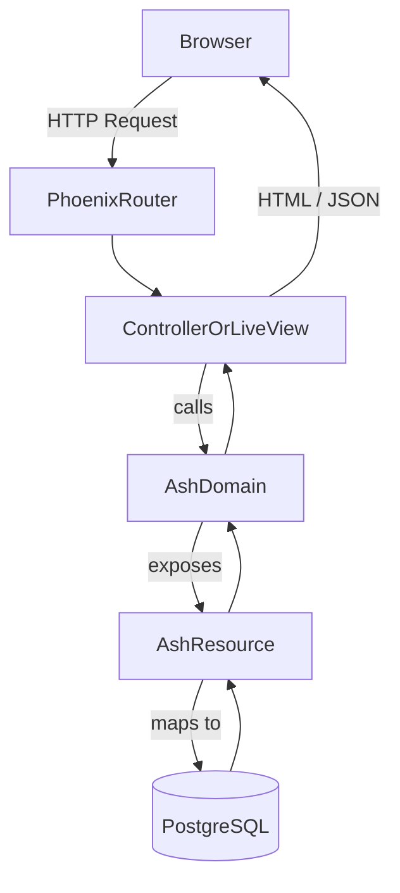
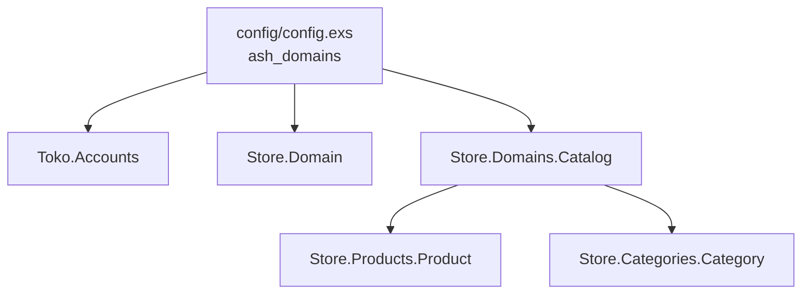
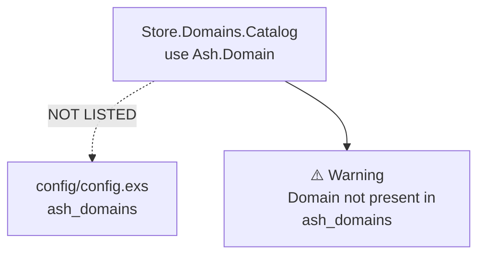
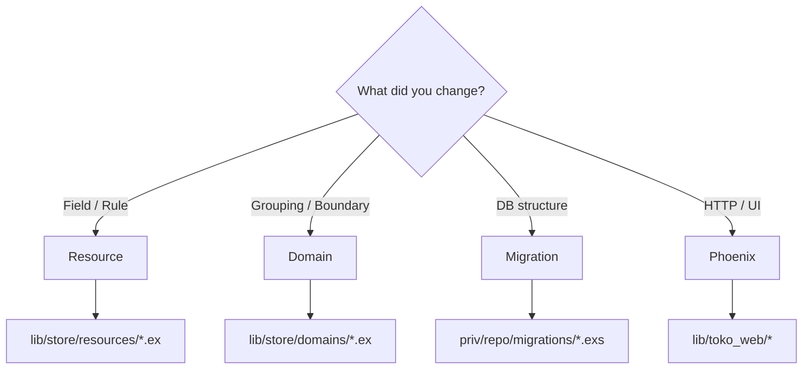
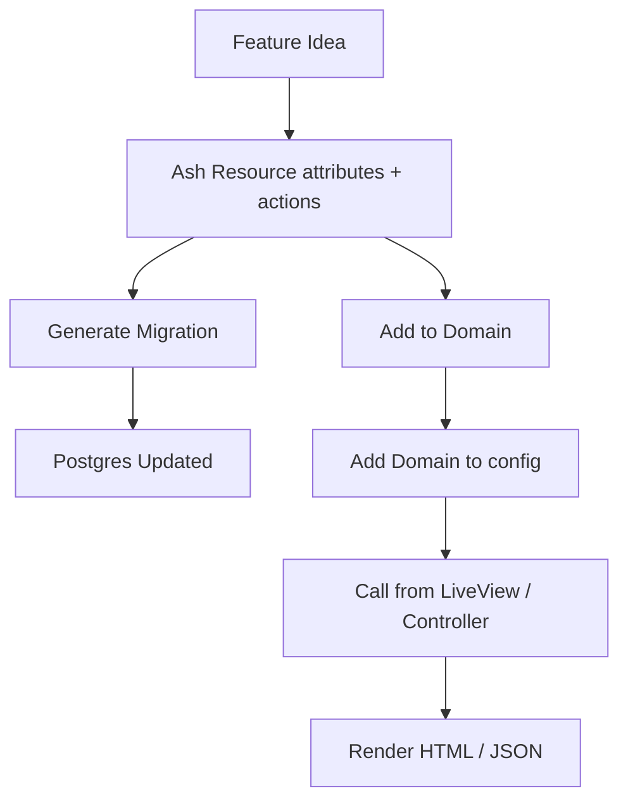
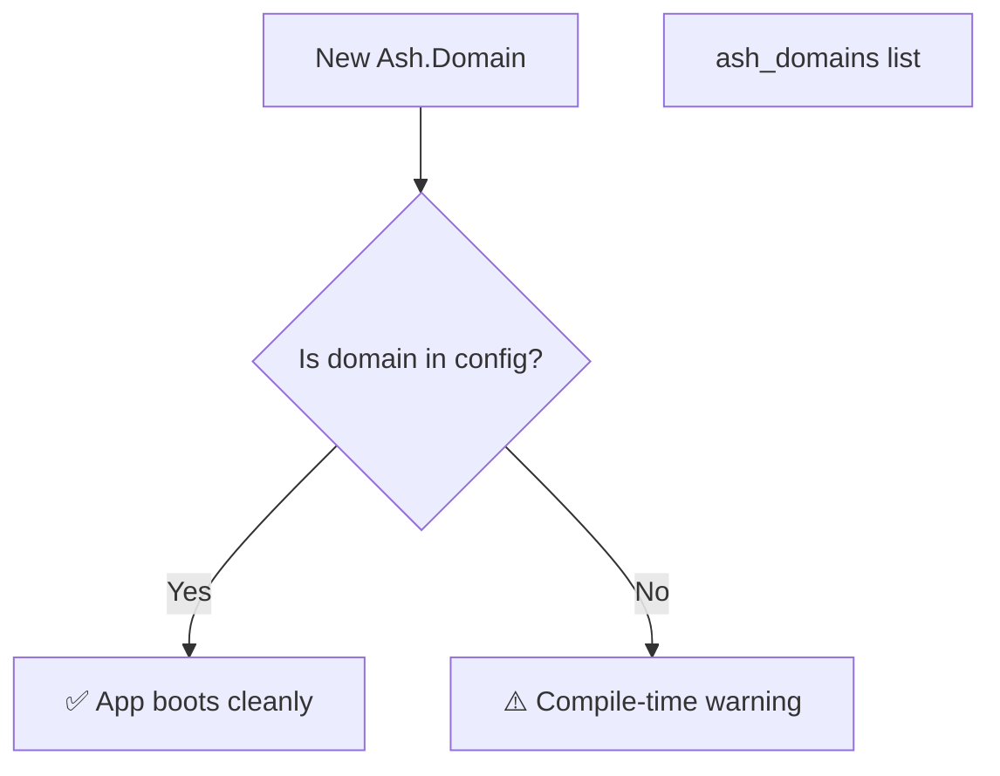

# Ash Framework

# 1. Big Picture: Ash + Phoenix (MVC-ish view)

# 2. Domain → Resource relationship (your case)

# 3. What happens when you add a Domain but forget config

# 4. Where to change what (visual cheat sheet)

# 5. Typical beginner workflow (step-by-step)

# 6. Why the warning exists (safety rail)

