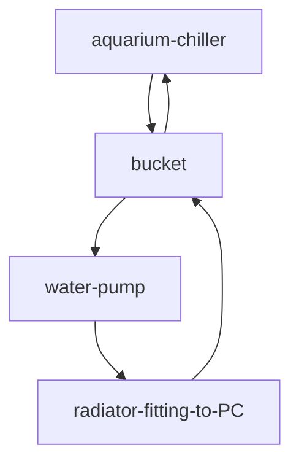

# Diagram

## Peripherals

Need to know the width of the intake and outlet of the radiator

- [Aquarium Chiller](https://www.tokopedia.com/javareef/hailea-hb60a-mini-chiller-nano-aquarium-akuarium-kecil?extParam=whid%3D1244273&aff_unique_id=&channel=others&chain_key=)
- [Bucket](https://www.tokopedia.com/belanjaperabotan/ember-plastik-80-liter-hitam?extParam=ivf%3Dfalse%26keyword%3Dember+mandi%26search_id%3D2025092309344094F6D7E04A4D45034GK6%26src%3Dsearch&t_id=1758620590862&t_st=1&t_pp=search_result&t_efo=search_pure_goods_card&t_ef=goods_search&t_sm=&t_spt=search_result)
- [Water Pump](https://www.tokopedia.com/jasmine-no1/cod-pompa-air-10-tahun-tidak-buruk-pompa-air-celup-aquarium-25w-pompa-akuarium-pompa-air-aquarium-pompa-1730445629454321655?extParam=ivf%3Dfalse%26keyword%3Dpompa+akuarium%26search_id%3D2025092309443339059724F73A99343DBT%26src%3Dsearch&t_id=1758620590862&t_st=4&t_pp=search_result&t_efo=search_pure_goods_card&t_ef=goods_search&t_sm=&t_spt=search_result)
- [Pipe](https://www.tokopedia.com/distributorpipa1/pipa-air-dingin-ppr-1-2-inch-4-mtr-pipa-pn10-20mm-pipa-ppr-20-mm-pipa-air-bersih-ppr-1730860478348691162?extParam=ivf%3Dfalse%26keyword%3Dpipa+ppr+1+2+inci%26search_id%3D2025092309472239059724F73A9921C2B7%26src%3Dsearch&t_id=1758620590862&t_st=5&t_pp=search_result&t_efo=search_pure_goods_card&t_ef=goods_search&t_sm=&t_spt=search_result) Lebar inlet = 12mm atau 1/2 inci
- Radiator Lebar inlet = 1 inci
