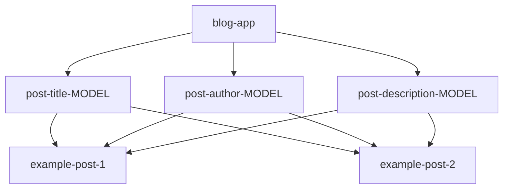
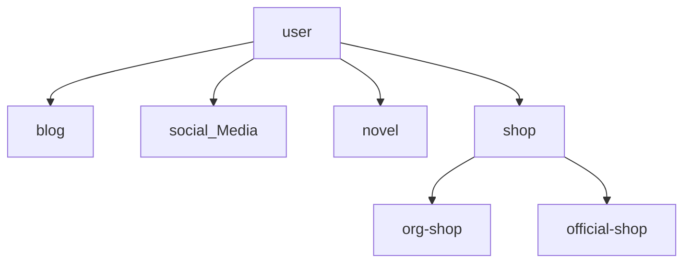
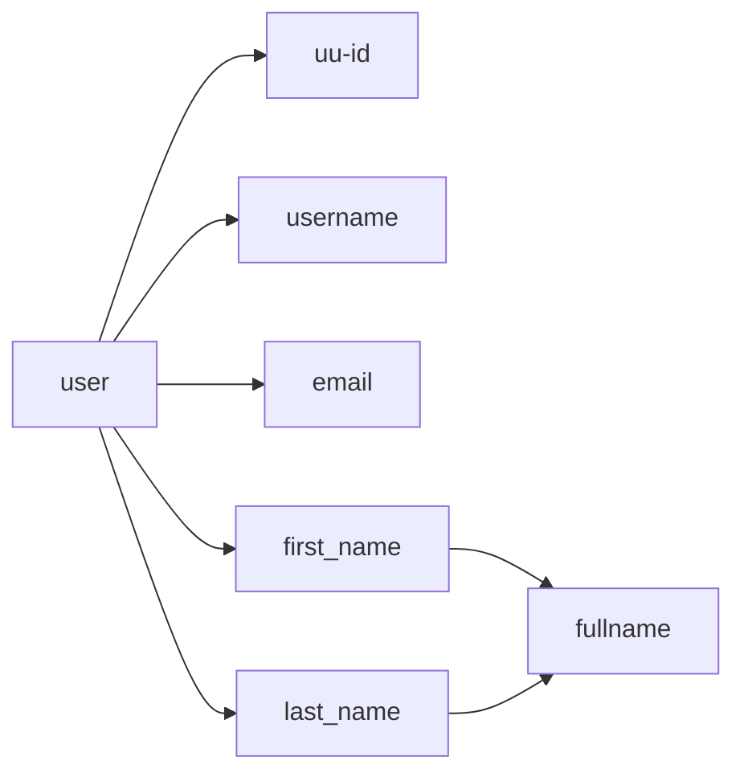
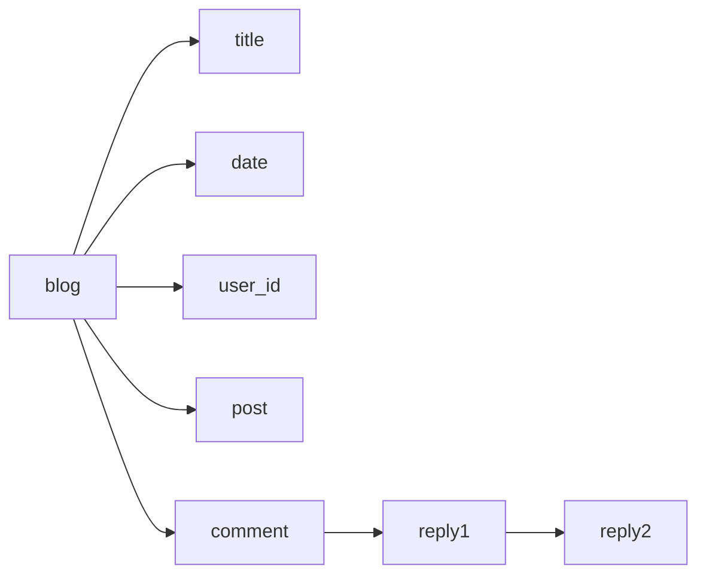

# Note Taking for Django
Note taking while hopefully "learning" Django.
There's another fullstack framework using functional programming called `Phoenix Framework` using `Elixir` and `Erlang`

Django written tutorial or documentation:
1. [DJANGO GIRLS' TUTORIAL](https://tutorial.djangogirls.org/en/)
2. [Django Official Documentation](https://docs.djangoproject.com/en/5.1/)

Youtube Videos: (this might be another link, cause there's to many to list):
1. [7 hour long: Python Tutorial: Build a Course Platform with Django, HTMX, TailwindCSS and Cloudinary](https://www.youtube.com/watch?v=I_IchaIdmnA)
2.

## Understanding Django

Django framework is based on MVC(Model, View, Controller), which in Django jargon means `Model`, the "View" means `Templates` and the "Controller" is `Views`. Or in [`Django's words is MTV`](https://docs.djangoproject.com/en/5.1/faq/general/#django-appears-to-be-a-mvc-framework-but-you-call-the-controller-the-view-and-the-view-the-template-how-come-you-don-t-use-the-standard-names).

### Model + Templates + Views + urls.py

#### Django Model
Models is where you define your database "models".
Models are a set of things saved in a database. Like in a `blog app`; blog posts, blog authors, the blog article, when you created the blog etc.. Is a set of things/data inside the blog app.



#### Django Templates

`Templates` is where how you configure the html and css. If you want to, each app has to have a `templates` folder inside their `app name`.
Example the app: `blog/templates/blog/index.html` or `styles.css`

#### Django Views
`Views` is where you `"render"` the website's or apps output or looks.

#### Django URLS
Is where you code your `views` link.
Example: `example.com/<urls-goes-here>`

##### Data Design

Global Design:


User Model:



Blog Model:



Social Media Model:

```mermaid
  sosmed-->post
  sosmed-->description
  sosmed-->likes
  sosmed-->comments
  sosmed-->reposts
```
