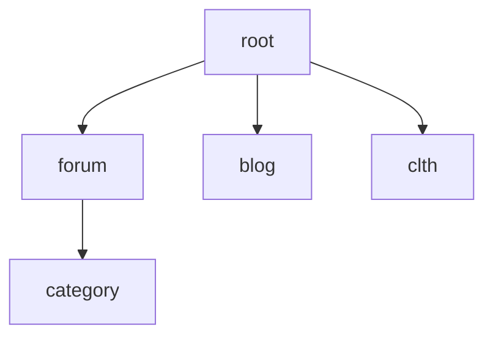
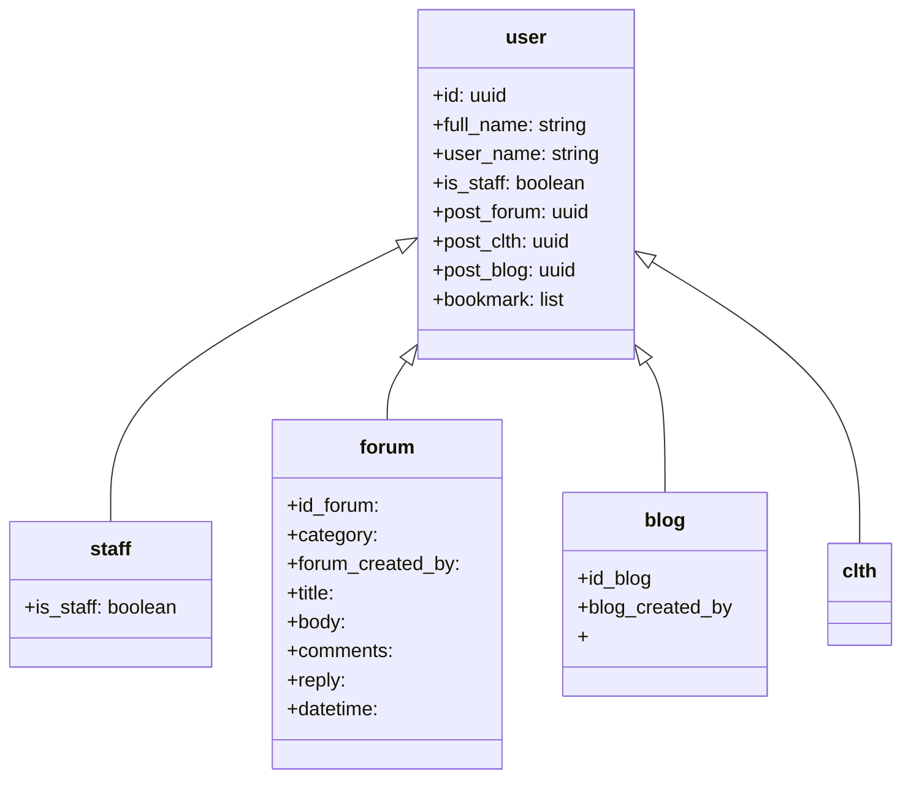

# How to install

Use [`mise`](https://mise.jdx.dev/)

Further reading: [Source on Github](https://github.com/asdf-vm/asdf-erlang)

## Learning Elixir and Phoenix Framework

The best way to learn is by doing.
Lets start the hard way. Web development.

What is a website?

## Sources:

1. [Elixir School](https://elixirschool.com/en)
2. [Elixir HexDocs](https://hexdocs.pm/elixir/introduction.html)
3. [Phoenix HexDocs](https://hexdocs.pm/phoenix/overview.html)

### Mapping

### Database Mapping

